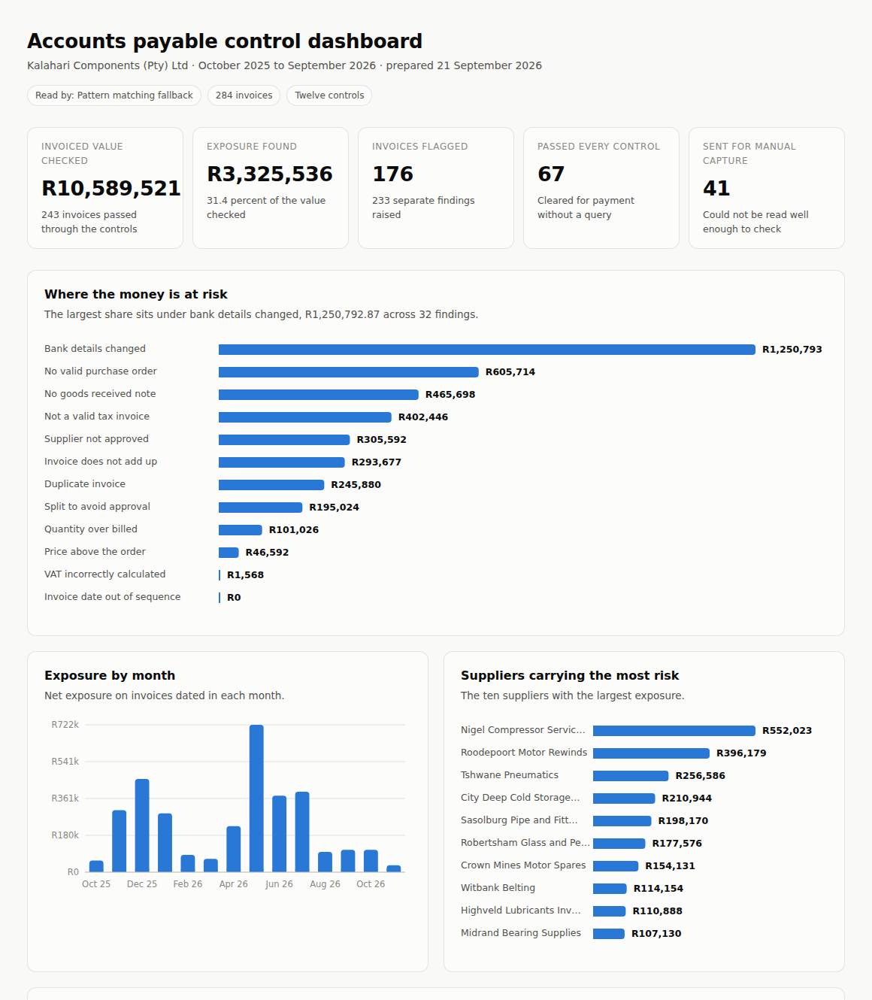
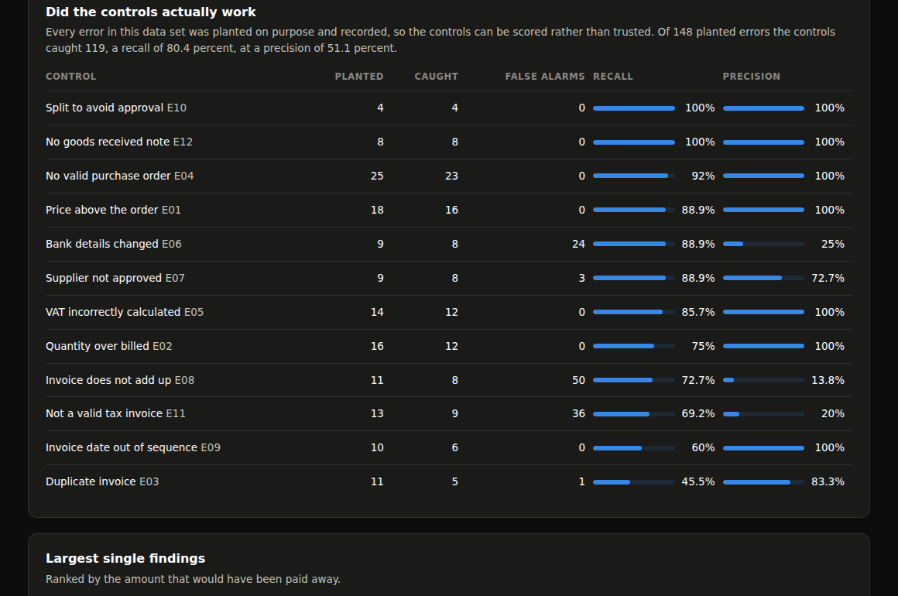

# Accounts payable automation with Claude

Supplier invoices arrive as PDFs. A language model reads them. Ordinary Python
decides whether they should be paid.



This is a working accounts payable system built around the three way match, the
control that compares an invoice against the purchase order that authorised it
and the goods received note that proves the goods arrived. It runs twelve
checks, values every exception in rands, and measures its own accuracy against a
set of errors that were planted on purpose.

The company, Kalahari Components (Pty) Ltd, is fictional. So is every invoice.
The controls, the tax rules and the approval policy are not.

---

## The idea behind it

Two jobs that look like one:

**Reading the document** is genuinely hard. Every supplier uses a different
layout. One writes "Invoice No.", another "Document No", a third "INVOICE #".
Totals sit in different corners. About one in six arrives as a scan with no text
layer at all. This is what a language model is good at.

**Deciding whether to pay** is not hard, but it has to be exactly right every
time and it has to be explainable to an auditor. A model that is right most of
the time is the wrong tool. This is plain Python, and it is deliberate.

Getting that split wrong is the usual failure of "AI for finance". The model
here is told, in as many words, to transcribe and not to correct. A helpful
model that quietly fixes VAT which does not add up would silence the very
control that exists to catch it.

---

## What it caught

Figures below are from a full run over 284 invoices. They come out of
`outputs/accuracy_report.json` and change if you rerun it.

| | |
|---|---|
| Invoices processed | 284 |
| Invoiced value checked | R10 589 521 |
| Exposure found | R3 325 536 |
| Invoices flagged | 176 |
| Passed every control | 67 |
| Could not be read, sent for manual capture | 41 |
| Separate findings raised | 233 |

The largest single exposure was a set of invoices asking for payment into a bank
account that does not match the one held on the supplier master file. That is
the shape payment redirection fraud takes in practice, and it is invisible to a
person checking that the arithmetic is right.

---

## The twelve controls

| Code | Check | Severity |
|---|---|---|
| E01 | Unit price above the purchase order, past a 2 percent or R50 tolerance | High |
| E02 | Quantity billed exceeds quantity the warehouse booked in | High |
| E03 | Duplicate invoice, by number or by same supplier, same amount, within ten days | High |
| E04 | No purchase order quoted, or one that does not exist | Medium |
| E05 | VAT is not 15 percent of the amount excluding VAT | Medium |
| E06 | Bank account differs from the supplier master file | High |
| E07 | Supplier is not on the approved vendor master file | High |
| E08 | Lines do not sum to the subtotal, or the totals do not reconcile | Medium |
| E09 | Invoice dated before the order was raised or before the goods arrived | Medium |
| E10 | Several invoices from one supplier just under an approval limit | High |
| E11 | Above R5 000 but missing a particular required for a full tax invoice | Medium |
| E12 | Order and invoice exist but the goods were never booked in | High |

Each finding carries the rand amount that would have been lost or mis-stated had
the invoice been paid as it arrived, plus a plain sentence telling the clerk what
to do about it.

### The South African rules used

- Standard VAT rate is 15 percent.
- A full tax invoice is required where the consideration exceeds R5 000. At or
  below that an abridged tax invoice is enough.
- A full tax invoice must carry the words Tax Invoice, the supplier's name,
  address and VAT registration number, the recipient's name, a serial number, the
  date, a description of the supply, the value, the tax charged and the total.
  Missing any of these means the input VAT cannot be claimed, which is why E11
  values the finding at the VAT rather than at the whole invoice.

Company approval policy, which drives E10: buyer up to R10 000, department
manager to R50 000, finance manager to R250 000, chief financial officer above.

---

## Does it work

Every error in the sample was planted deliberately and written to
`data/ground_truth/invoice_truth.csv` before a single invoice was read. Nothing
below is an estimate.

Recall is the share of planted errors that were caught. Precision is the share
of findings that were real.

Run on the pattern matching fallback, with no API key:

| | |
|---|---|
| Planted errors | 148 |
| Caught | 119 |
| Recall | 80.4 percent |
| Precision | 51.1 percent |
| Field level reading accuracy | 70.5 percent |
| Reading accuracy on invoices with a text layer | 82.4 percent |
| Reading accuracy on scanned invoices | 0.2 percent |

That last row is the whole argument. A regular expression cannot read a page
that has no text on it, so 41 invoices never reached the controls at all, and 24
of the 29 misses are simply documents the parser could not open. Half the alarms
it did raise were false, almost all of them because it misread a field rather
than because anything was wrong with the invoice.

Rerun with an API key and the same measurement runs again. The comparison is the
point of the project, so the numbers above deliberately show the weaker route
rather than hiding it.

---

## Running it

```bash
pip install -r requirements.txt
python run_all.py --fallback
```

That generates the data, builds the database, reads all 284 invoices, runs the
controls, scores itself and writes the dashboard, in about fifteen seconds on an
ordinary laptop. Open `outputs/dashboard.html` when it finishes.

To use the model instead:

```bash
cp .env.example .env        # then paste your key into it
python run_all.py
```

A Claude app subscription does not include API access. Keys come from
[console.anthropic.com](https://console.anthropic.com) and are billed on usage.
Reading all 284 invoices costs roughly three US dollars on Sonnet, about half
that on Haiku. `python src/step3_extract_invoices.py --limit 10` is a cheaper way
to check it works first.

Steps also run on their own, which is usually what you want:

```bash
python src/step1_generate_data.py      # invoices, orders, receipts, ground truth
python src/step2_build_database.py     # schema and load
python src/step3_extract_invoices.py   # read the PDFs
python src/step4_run_controls.py       # the twelve checks
python src/step5_measure_accuracy.py   # score it against what was planted
python src/step6_build_reports.py      # CSV, Excel, dashboard data
python src/step7_build_dashboard.py    # the dashboard
```

---

## How it is put together

```
config.py                    company details, tax rules, tolerances, the catalogue
run_all.py                   runs every step in order
sql/schema.sql               the database
src/
  generate/                  builds the sample company and renders the PDFs
  extraction/
    prompts.py               what Claude is asked to do
    claude_client.py         the API call, retries, JSON handling
    pdf_reader.py            text layer out, or a page image for scans
    fallback_parser.py       the no API route
  controls/rules.py          the twelve checks, no model involved
  step1 .. step7             the pipeline
outputs/                     dashboard, CSV, Excel, accuracy report
docs/                        write up, screenshots
data/sample_invoices/        six of the generated invoices, to look at
```

The 284 invoice PDFs are not committed, because step 1 regenerates them
identically every time from a fixed seed. Six are included under
`data/sample_invoices` so the four layouts and a scan can be seen without
running anything.

Three routes through extraction, chosen per document on evidence rather than a
flag:

- `claude_text` when the PDF has a text layer worth reading
- `claude_vision` when it does not, so the page image goes to the model instead
- `rules_fallback` when there is no API key, or when the API could not be reached

Invoices that come back without a total or an invoice number are marked
`manual_capture` and the controls are not run on them. Running twelve checks
against a document nobody could read produces findings that say nothing about
the supplier and everything about the reader.

---

## Data model

Nine tables. The company's own records on one side, what was read off the
supplier's document on the other, and the findings in between.

- `suppliers`, `purchase_orders`, `po_lines`, `goods_received_notes`, `grn_lines`
  are trusted. They come from the company's systems.
- `invoices`, `invoice_lines` are not trusted. They are what a supplier claims.
- `exceptions` is what happened when the two were compared.
- `extraction_log` records the route, the tokens and the time for every document,
  so the cost and speed figures come from measurement rather than memory.

---

## Outputs

| File | What it is |
|---|---|
| `outputs/dashboard.html` | Self contained dashboard, opens in any browser |
| `outputs/ap_exception_report.xlsx` | Six sheets, the working file for a creditors clerk |
| `outputs/exceptions.csv` | Every finding, one row each, flat for Power BI |
| `outputs/invoice_register.csv` | Every invoice with its status and exposure |
| `outputs/supplier_risk.csv` | Exposure by supplier |
| `outputs/monthly_summary.csv` | Spend and exposure by month |
| `outputs/control_performance.csv` | Recall and precision per control |
| `outputs/accuracy_report.json` | Everything the write up quotes |
| `docs/write_up.docx` | Three page write up of the problem, the approach and the results |



The CSV files are flat on purpose so they can be dropped into Power BI without
reshaping.

---

## What it does not do

Worth saying plainly.

- The data is generated. Exceptions appear in roughly half the invoices, which is
  far above a real creditors inbox. That was chosen so every control has enough
  cases to score. Real precision and recall on live data would differ.
- There is no approval workflow, no payment run and no integration with an ERP.
  It ends at the exception report.
- Line level matching is on stock code. A supplier who writes their own codes
  would need fuzzy matching on the description.
- The duplicate check looks at number and at amount. It would not catch an
  invoice resubmitted with the amount changed by a rand.

---

## Notes

Built as a portfolio project. BCom Information Systems, University of
Johannesburg.
